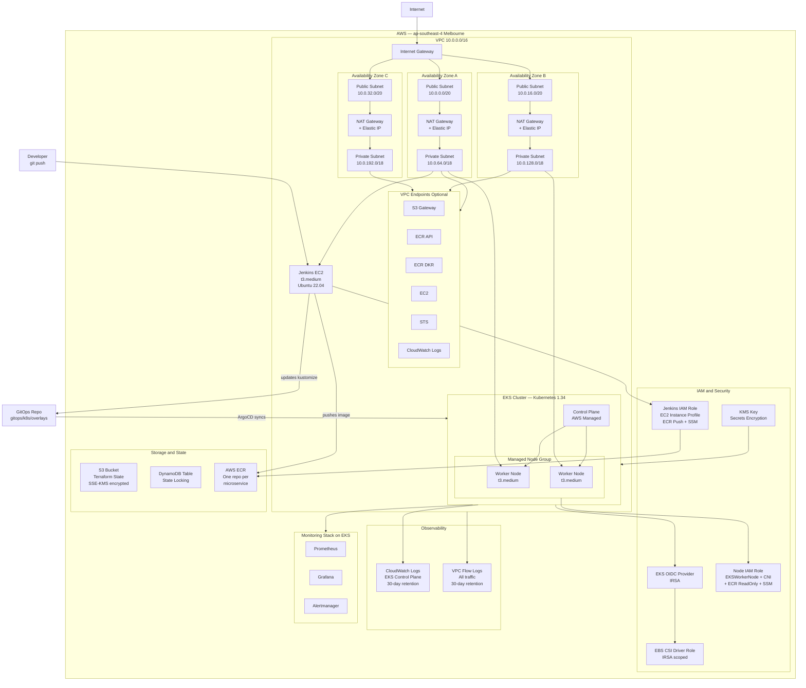
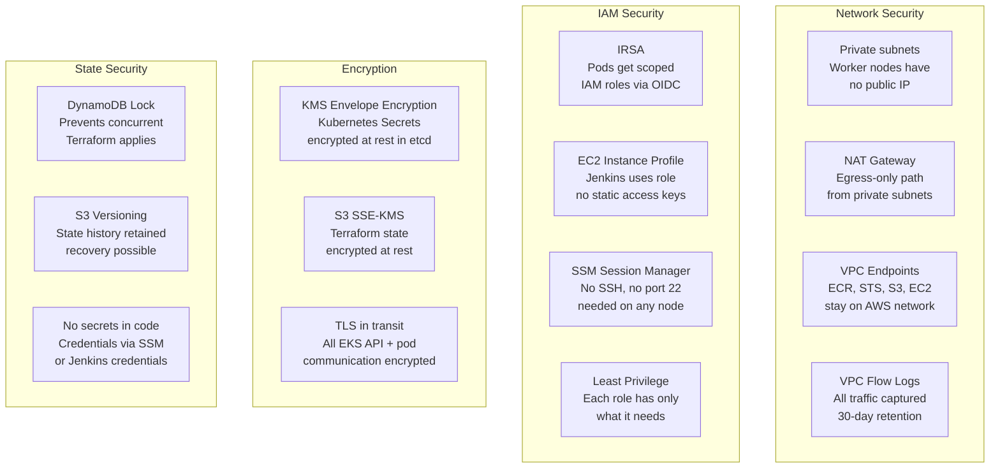

# Infrastructure — Terraform on AWS

> All AWS infrastructure for the Online Boutique DevSecOps project is managed as code using Terraform. No manual console changes — every resource is version-controlled, reproducible, and auditable.

---

## Table of Contents

- [Infrastructure — Terraform on AWS](#infrastructure--terraform-on-aws)
  - [Table of Contents](#table-of-contents)
  - [Overview](#overview)
  - [Module Structure](#module-structure)
  - [Architecture Diagram](#architecture-diagram)
  - [Network Layout](#network-layout)
    - [Subnet CIDR Calculation](#subnet-cidr-calculation)
    - [Traffic Flow](#traffic-flow)
    - [NAT Gateway Strategy](#nat-gateway-strategy)
  - [Resources Provisioned](#resources-provisioned)
    - [VPC / Networking](#vpc--networking)
    - [EKS Cluster](#eks-cluster)
      - [Node Group Configuration](#node-group-configuration)
      - [Node IAM Policies](#node-iam-policies)
      - [Control Plane Logging](#control-plane-logging)
      - [KMS Secrets Encryption](#kms-secrets-encryption)
      - [IRSA — IAM Roles for Service Accounts](#irsa--iam-roles-for-service-accounts)
    - [Jenkins EC2](#jenkins-ec2)
    - [Monitoring](#monitoring)
  - [Security Design](#security-design)
  - [Remote State Setup](#remote-state-setup)
  - [Deployment Guide](#deployment-guide)
    - [Step 1 — VPC](#step-1--vpc)
    - [Step 2 — EKS](#step-2--eks)
    - [Step 3 — Jenkins (parallel with Step 4)](#step-3--jenkins-parallel-with-step-4)
    - [Step 4 — Monitoring (parallel with Step 3)](#step-4--monitoring-parallel-with-step-3)
  - [Tear Down](#tear-down)
  - [Variable Reference](#variable-reference)
    - [VPC Module (`infra/terraform/modules/vpc/`)](#vpc-module-infraterraformmodulesvpc)
    - [EKS Module (`infra/terraform/modules/eks/`)](#eks-module-infraterraformmoduleseks)

---

## Overview

| Setting | Value |
|---|---|
| Cloud Provider | AWS |
| Region | `ap-southeast-4` (Melbourne) |
| Terraform version | `>= 1.5.0` |
| AWS Provider version | `~> 6.0` |
| Kubernetes version | `1.34` |
| State backend | S3 + DynamoDB (SSE-KMS) |
| CI Server | Jenkins on EC2 |
| CD / GitOps | ArgoCD on EKS |

---

## Module Structure

```
infra/
├── terraform/
│   └── modules/
│       ├── vpc/               # VPC, subnets, NAT gateways, VPC endpoints, flow logs
│       │   ├── main.tf
│       │   ├── variables.tf
│       │   └── output.tf
│       │
│       └── eks/               # EKS cluster, node group, addons, IRSA, KMS
│           ├── main.tf
│           ├── variables.tf
│           └── output.tf
│
├── jenkins/                   # Jenkins EC2, IAM instance profile, security group
├── monitoring/                # Prometheus + Grafana (kube-prometheus-stack)
└── README.md
```

---

## Architecture Diagram



---

## Network Layout

### Subnet CIDR Calculation

The VPC CIDR is `10.0.0.0/16`. Subnets are calculated dynamically using `cidrsubnet()` based on AZ count:

| Type | AZ | CIDR | Usable IPs | Used For |
|---|---|---|---|---|
| **Public** | ap-southeast-4a | `10.0.0.0/20` | 4,091 | ALB, NLB, NAT Gateway |
| **Public** | ap-southeast-4b | `10.0.16.0/20` | 4,091 | ALB, NLB, NAT Gateway |
| **Public** | ap-southeast-4c | `10.0.32.0/20` | 4,091 | ALB, NLB, NAT Gateway |
| **Private** | ap-southeast-4a | `10.0.64.0/18` | 16,379 | EKS Worker Nodes, Jenkins |
| **Private** | ap-southeast-4b | `10.0.128.0/18` | 16,379 | EKS Worker Nodes |
| **Private** | ap-southeast-4c | `10.0.192.0/18` | 16,379 | EKS Worker Nodes |

### Traffic Flow

```
Internet
    │
    ▼
Internet Gateway
    │
    ▼
Public Subnets  ──────────────────────────────────────────
    │  (ALB / NLB inbound)         │  (NAT egress for private)
    ▼                              ▼
EKS Nodes / Jenkins  ◄──  Private Subnets (no public IPs)
    │
    │  AWS API calls (ECR, STS, EC2, CloudWatch)
    ▼
VPC Endpoints  ──  traffic stays within AWS network
    (S3, ECR API, ECR DKR, EC2, STS, CloudWatch Logs)
```

### NAT Gateway Strategy

| Mode | `single_nat_gateway` | NAT GW Count | Use Case |
|---|---|---|---|
| High Availability | `false` (default) | 3 (one per AZ) | Production |
| Cost-saving | `true` | 1 (single point of failure) | Dev / Test |

---

## Resources Provisioned

### VPC / Networking

**Path:** `infra/terraform/modules/vpc/`

| Resource | Name Pattern | Count | Notes |
|---|---|---|---|
| `aws_vpc` | `<cluster>-vpc` | 1 | `10.0.0.0/16`, DNS hostnames + support enabled |
| `aws_internet_gateway` | `<cluster>-igw` | 1 | Attached to VPC |
| `aws_subnet` public | `<cluster>-public-<az>` | 3 | `/20`, `map_public_ip_on_launch = true` |
| `aws_subnet` private | `<cluster>-private-<az>` | 3 | `/18`, no public IPs |
| `aws_eip` | `<cluster>-nat-eip-<n>` | 3 (or 1) | Elastic IPs for NAT gateways |
| `aws_nat_gateway` | `<cluster>-nat-<n>` | 3 (or 1) | One per AZ for HA; single optional for dev |
| `aws_route_table` public | `<cluster>-public-rt` | 1 | `0.0.0.0/0` → IGW |
| `aws_route_table` private | `<cluster>-private-rt-<az>` | 3 | `0.0.0.0/0` → NAT GW per AZ |
| `aws_route_table_association` | — | 6 | 3 public + 3 private associations |
| `aws_vpc_endpoint` S3 | `<cluster>-s3-endpoint` | 1* | Gateway type — free |
| `aws_vpc_endpoint` ECR API | `<cluster>-ecr-api-endpoint` | 1* | Interface type, private DNS |
| `aws_vpc_endpoint` ECR DKR | `<cluster>-ecr-dkr-endpoint` | 1* | Interface type, private DNS |
| `aws_vpc_endpoint` EC2 | `<cluster>-ec2-endpoint` | 1* | Interface type, for node registration |
| `aws_vpc_endpoint` STS | `<cluster>-sts-endpoint` | 1* | Interface type, required for IRSA |
| `aws_vpc_endpoint` Logs | `<cluster>-logs-endpoint` | 1* | Interface type, CloudWatch |
| `aws_security_group` | `<cluster>-vpc-endpoints-sg` | 1* | Port 443 inbound from VPC CIDR only |
| `aws_flow_log` | `<cluster>-flow-logs` | 1* | ALL traffic, 60s aggregation interval |
| `aws_cloudwatch_log_group` | `/aws/vpc-flow-logs/<cluster>` | 1* | 30-day retention |
| `aws_iam_role` | `<cluster>-flow-logs-role` | 1* | Allows VPC to write logs to CloudWatch |

*\* conditional on `enable_vpc_endpoints` / `enable_flow_logs` flags*

**Key Subnet Tags** — required for the AWS Load Balancer Controller:

| Tag | Value | Applied To |
|---|---|---|
| `kubernetes.io/role/elb` | `1` | Public subnets — public ALB/NLB |
| `kubernetes.io/role/internal-elb` | `1` | Private subnets — internal NLB |
| `kubernetes.io/cluster/<name>` | `shared` | Both — cluster resource discovery |
| `Tier` | `public` / `private` | Both — logical grouping |

---

### EKS Cluster

**Path:** `infra/terraform/modules/eks/`

| Resource | Name Pattern | Notes |
|---|---|---|
| `aws_eks_cluster` | `<cluster_name>` | Kubernetes 1.34, private + public endpoint |
| `aws_iam_role` cluster | `<cluster>-cluster-role` | `eks.amazonaws.com` service principal |
| `aws_iam_role_policy_attachment` | — | `AmazonEKSClusterPolicy` |
| `aws_security_group` | — | Controls API server ingress/egress |
| `aws_kms_key` | — | Envelope encryption for Kubernetes Secrets at rest |
| `aws_cloudwatch_log_group` | `/aws/eks/<cluster>/cluster` | 30-day retention |
| `aws_iam_openid_connect_provider` | — | OIDC provider for IRSA (pod IAM) |
| `aws_iam_role` node | `<cluster>-node-role` | `ec2.amazonaws.com` service principal |
| `aws_iam_role_policy_attachment` node | — | 4 policies (see below) |
| `aws_eks_node_group` | `<cluster>-node-group` | Managed, deployed to private subnets |
| `aws_eks_addon` vpc-cni | — | AWS VPC CNI — pod networking |
| `aws_eks_addon` coredns | — | Cluster-internal DNS |
| `aws_eks_addon` kube-proxy | — | Node-level network proxy |
| `aws_eks_addon` aws-ebs-csi-driver | — | EBS persistent volume support |
| `aws_iam_role` EBS CSI | `<cluster>-ebs-csi-driver` | IRSA role scoped to `ebs-csi-controller-sa` |
| `aws_iam_role_policy_attachment` EBS CSI | — | `AmazonEBSCSIDriverPolicy` |

#### Node Group Configuration

| Setting | Value |
|---|---|
| Instance type | `t3.medium` |
| Capacity type | `ON_DEMAND` |
| Desired nodes | `2` |
| Minimum nodes | `1` |
| Maximum nodes | `5` |
| Root disk size | `50 GB` |
| Subnet placement | Private subnets only (no public IPs) |
| Max unavailable during update | `1` |
| Lifecycle | `desired_size` ignored after creation (cluster autoscaler manages it) |

#### Node IAM Policies

| Policy | Why It's Needed |
|---|---|
| `AmazonEKSWorkerNodePolicy` | Allows nodes to register and communicate with the EKS control plane |
| `AmazonEKS_CNI_Policy` | Allows the VPC CNI plugin to assign IPs and manage pod networking |
| `AmazonEC2ContainerRegistryReadOnly` | Allows nodes to pull container images from ECR |
| `AmazonSSMManagedInstanceCore` | Enables SSM Session Manager — no SSH or port 22 required |

#### Control Plane Logging
All five log streams are enabled and sent to CloudWatch Logs with 30-day retention:

| Log Type | What It Captures |
|---|---|
| `api` | All API server requests |
| `audit` | Who did what and when (compliance) |
| `authenticator` | IAM/OIDC authentication attempts |
| `controllerManager` | Deployment, replication, and scheduling decisions |
| `scheduler` | Pod scheduling events |

#### KMS Secrets Encryption
When `enable_secrets_encryption = true` (default), a dedicated KMS key is created for envelope encryption of all Kubernetes Secrets stored in etcd. This means secrets are encrypted at rest even if the etcd storage is compromised.

#### IRSA — IAM Roles for Service Accounts
An OIDC provider is provisioned from the EKS cluster's identity issuer URL. This allows Kubernetes service accounts to exchange a signed JWT for temporary AWS credentials — no static keys on pods.

Currently provisioned IRSA roles:

| Role | Service Account | Permissions |
|---|---|---|
| `<cluster>-ebs-csi-driver` | `kube-system:ebs-csi-controller-sa` | `AmazonEBSCSIDriverPolicy` |

---

### Jenkins EC2

**Path:** `infra/jenkins/`

Provisions the Jenkins CI server that runs the DevSecOps pipeline.

**Resources provisioned:**

| Resource | Configuration |
|---|---|
| EC2 instance | `t3.medium`, Ubuntu 22.04 LTS, private subnet |
| IAM instance profile | Scoped ECR push permissions + SSM access (no SSH keys needed) |
| Security group | Port 8080 (Jenkins UI) from known CIDRs; port 22 restricted |
| Elastic IP | Stable public IP for webhook ingress and DNS |
| EBS volume | Persistent `/var/lib/jenkins` home directory |

**IAM permissions on the Jenkins instance profile:**

| Permission | Purpose |
|---|---|
| `ecr:GetAuthorizationToken` | Authenticate with ECR |
| `ecr:BatchCheckLayerAvailability` | Check which image layers exist |
| `ecr:PutImage` | Push final image manifest |
| `ecr:InitiateLayerUpload` | Start layer upload |
| `ecr:UploadLayerPart` | Upload image layer chunks |
| `ecr:CompleteLayerUpload` | Complete layer upload |
| `ssm:GetParameter` | Read secrets from SSM Parameter Store |

After provisioning, install the required CI tools (Gitleaks, SonarQube Scanner, Trivy, OWASP Dependency-Check, Hadolint, Kustomize) — see [`jenkins/README.md`](./jenkins/README.md).

```bash
cd infra/jenkins
terraform init
terraform plan
terraform apply
```

---

### Monitoring

**Path:** `infra/monitoring/`

Deploys the Prometheus + Grafana observability stack into EKS using the `kube-prometheus-stack` Helm chart.

**What gets deployed:**
- Prometheus (metrics collection + alerting rules)
- Grafana (dashboards and visualization)
- Alertmanager (alert routing — email, Slack, PagerDuty)
- Node Exporter (per-node host metrics)
- kube-state-metrics (Kubernetes object state metrics)

```bash
# Via Helm
helm repo add prometheus-community https://prometheus-community.github.io/helm-charts
helm repo update

helm install monitoring prometheus-community/kube-prometheus-stack \
  --namespace monitoring \
  --create-namespace \
  --set grafana.adminPassword=<your-password> \
  -f infra/monitoring/values.yaml
```

See [`monitoring/README.md`](./monitoring/README.md) for dashboard imports and alerting setup.

---

## Security Design



| Layer | Control | Implementation |
|---|---|---|
| **Network** | No public IPs on workers | `map_public_ip_on_launch = false` on private subnets |
| **Network** | Egress-only from private | NAT Gateway; no inbound routes to private subnets |
| **Network** | AWS API traffic isolation | VPC Interface Endpoints — ECR, STS, EC2, Logs never leave AWS network |
| **Network** | Full audit trail | VPC Flow Logs → CloudWatch, 30-day retention, 60s aggregation |
| **IAM** | Pod-scoped permissions | IRSA — Kubernetes service accounts assume IAM roles via OIDC |
| **IAM** | No static keys on CI server | Jenkins uses EC2 instance profile — credentials rotate automatically |
| **IAM** | No SSH on any node | SSM Session Manager via `AmazonSSMManagedInstanceCore` policy |
| **IAM** | Least privilege everywhere | Each IAM role has only the minimum permissions required |
| **Encryption** | Secrets at rest | KMS envelope encryption on EKS etcd |
| **Encryption** | State at rest | S3 remote state encrypted with SSE-KMS |
| **State** | Concurrent apply safety | DynamoDB lock table prevents race conditions |
| **State** | No hardcoded secrets | Zero credentials in `.tf` files; all via SSM or Jenkins credentials store |

---

## Remote State Setup

One-time setup before any Terraform module is applied:

```bash
# 1. Create S3 bucket
aws s3api create-bucket \
  --bucket online-boutique-tf-state \
  --region ap-southeast-4 \
  --create-bucket-configuration LocationConstraint=ap-southeast-4

# 2. Enable versioning
aws s3api put-bucket-versioning \
  --bucket online-boutique-tf-state \
  --versioning-configuration Status=Enabled

# 3. Enable KMS encryption
aws s3api put-bucket-encryption \
  --bucket online-boutique-tf-state \
  --server-side-encryption-configuration '{
    "Rules": [{
      "ApplyServerSideEncryptionByDefault": {"SSEAlgorithm": "aws:kms"}
    }]
  }'

# 4. Block all public access
aws s3api put-public-access-block \
  --bucket online-boutique-tf-state \
  --public-access-block-configuration \
    "BlockPublicAcls=true,IgnorePublicAcls=true,BlockPublicPolicy=true,RestrictPublicBuckets=true"

# 5. Create DynamoDB lock table
aws dynamodb create-table \
  --table-name terraform-lock \
  --attribute-definitions AttributeName=LockID,AttributeType=S \
  --key-schema AttributeName=LockID,KeyType=HASH \
  --billing-mode PAY_PER_REQUEST \
  --region ap-southeast-4
```

Reference in each module's `backend.tf`:

```hcl
terraform {
  backend "s3" {
    bucket         = "online-boutique-tf-state"
    key            = "vpc/terraform.tfstate"    # change per module
    region         = "ap-southeast-4"
    dynamodb_table = "terraform-lock"
    encrypt        = true
  }
}
```

---

## Deployment Guide

> **Modules must be applied in order** — EKS depends on VPC outputs, Jenkins and Monitoring depend on EKS.

```
1. Remote State (S3 + DynamoDB)   ← one-time manual setup above
        │
        ▼
2. infra/terraform/modules/vpc    ← VPC, subnets, NAT, endpoints
        │
        ▼
3. infra/terraform/modules/eks    ← EKS cluster, node group, addons, IRSA
        │
        ├──────────────────────────────────────┐
        ▼                                      ▼
4. infra/jenkins/                  5. infra/monitoring/
   Jenkins EC2 server                 Prometheus + Grafana on EKS
```

### Step 1 — VPC

```bash
cd infra/terraform/modules/vpc
terraform init
terraform plan -out=tfplan
terraform apply tfplan
```

### Step 2 — EKS

```bash
cd infra/terraform/modules/eks
terraform init
terraform plan -out=tfplan
terraform apply tfplan

# Configure kubectl
aws eks update-kubeconfig \
  --region ap-southeast-4 \
  --name <cluster_name>

# Verify nodes are ready
kubectl get nodes
kubectl get pods -A
```

### Step 3 — Jenkins (parallel with Step 4)

```bash
cd infra/jenkins
terraform init
terraform plan -out=tfplan
terraform apply tfplan
```

After provisioning, follow [`jenkins/README.md`](./jenkins/README.md) to install all CI tools.

### Step 4 — Monitoring (parallel with Step 3)

```bash
helm repo add prometheus-community https://prometheus-community.github.io/helm-charts
helm repo update

helm install monitoring prometheus-community/kube-prometheus-stack \
  --namespace monitoring \
  --create-namespace \
  -f infra/monitoring/values.yaml
```

---

## Tear Down

Destroy in reverse dependency order:

```bash
# 1. Monitoring (Helm)
helm uninstall monitoring -n monitoring

# 2. Jenkins
cd infra/jenkins && terraform destroy

# 3. EKS
cd infra/terraform/modules/eks && terraform destroy

# 4. VPC
cd infra/terraform/modules/vpc && terraform destroy
```

> ⚠️ Destroying the EKS cluster removes all running workloads including ArgoCD and all Online Boutique services. Confirm there is no critical state in-cluster before destroying.

---

## Variable Reference

### VPC Module (`infra/terraform/modules/vpc/`)

| Variable | Default | Description |
|---|---|---|
| `cluster_name` | required | Used for all resource names and K8s tags |
| `vpc_cidr` | `10.0.0.0/16` | VPC CIDR block |
| `az_count` | `3` | Number of AZs to span (min 2, max 6) |
| `single_nat_gateway` | `false` | `true` = 1 NAT GW cost-saving; `false` = 1 per AZ HA |
| `enable_vpc_endpoints` | `false` | Private endpoints for ECR, S3, STS, EC2, Logs |
| `enable_flow_logs` | `true` | VPC Flow Logs to CloudWatch |
| `flow_logs_retention_days` | `30` | CloudWatch log retention in days |
| `tags` | `{}` | Tags applied to all resources |

### EKS Module (`infra/terraform/modules/eks/`)

| Variable | Default | Description |
|---|---|---|
| `cluster_name` | required | EKS cluster name |
| `kubernetes_version` | `1.34` | Kubernetes version |
| `vpc_id` | required | VPC ID from VPC module output |
| `subnet_ids` | required | Private subnet IDs from VPC module output |
| `node_instance_types` | `["t3.medium"]` | EC2 instance type(s) for worker nodes |
| `node_desired_size` | `2` | Initial desired node count |
| `node_min_size` | `1` | Minimum node count |
| `node_max_size` | `5` | Maximum node count |
| `node_disk_size` | `50` | Root disk size in GB per node |
| `capacity_type` | `ON_DEMAND` | `ON_DEMAND` or `SPOT` |
| `enable_secrets_encryption` | `true` | KMS envelope encryption for K8s Secrets |
| `endpoint_private_access` | `true` | Enable private API server endpoint |
| `endpoint_public_access` | `true` | Enable public API server endpoint |
| `public_access_cidrs` | `["0.0.0.0/0"]` | CIDRs permitted to reach the public endpoint |
| `enabled_cluster_log_types` | all 5 | Control plane log streams to CloudWatch |
| `log_retention_days` | `30` | CloudWatch log retention in days |
| `tags` | `{}` | Tags applied to all resources |